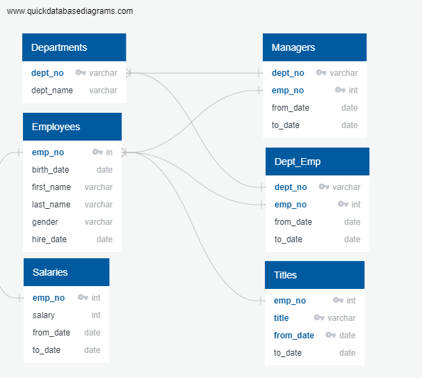

# Pewlett Hackard Analysis

## Overview of the Analysis:

The HR Analyst at Pewlett Hackard requested help with analyzing data to prepare for the upcoming retirement wave of baby boomer employees.  The company is trying to plan ahead to determine who will be retiring in the next few years and how many positions will need to be filled.  The analyst requested that six different Excel data sets be analyzed using SQL to determine the number of employees eligible for retirement for each position title and the number of employees eligible to participate in a mentorship program.

## Resources:

 - Data: departments.csv, dept_emp.csv, dept_manager.csv, employees.csv, salaries.csv, titles.csv
 - Software: PostgreSQL 12.4, pgAdmin 4, QuickDBD

## Results:

The analysis was completed in four major steps to determine the number of employees eligible for retirement by position title and the number of employees eligible to participate in the mentorship program.  The four steps are shown below.

1. )  ***Review data files:*** The first step was to review the data and determine the connections between the data files.  To do this, each data table was reviewed to identify what data was in the table, the data types, and the primary and foreign keys.  QuickDBD was then used to create a physical Entity Relation Diagram (ERD) to outline the data files, their data types and the flow of information between the tables.  See the ERD below.

     

2. )  ***Import data in SQL:*** The second step was to use the ERD to create the tables in SQL and import the data into each table.  The SQL script below shows how the tables were built and the relationships between the data.  Each column in each data table was identified along with it's data type.  The Primary and Foreign keys were identified as well as the data they referenced from the other tables.

    <table>
    <tr>
    <td>

```sql
CREATE TABLE departments(
	dept_no VARCHAR(4) NOT NULL, 
	dept_name VARCHAR(40) NOT NULL,
	PRIMARY KEY (dept_no),
	UNIQUE (dept_name)
);

CREATE TABLE employees(
	emp_no INT NOT NULL,
	birth_date DATE NOT NULL,
	first_name VARCHAR NOT NULL,
	last_name VARCHAR NOT NULL,
	gender VARCHAR NOT NULL,
	hire_date DATE NOT NULL,
	PRIMARY KEY (emp_no)
);

CREATE TABLE dept_manager(
	dept_no VARCHAR(4) NOT NULL,
	emp_no INT NOT NULL,
	from_date DATE NOT NULL,
	to_date DATE NOT NULL,
	FOREIGN KEY (emp_no) REFERENCES employees (emp_no),
	FOREIGN KEY (dept_no) REFERENCES departments (dept_no),
	PRIMARY KEY (emp_no, dept_no)
);
```

   </td>
    <td>
	
```sql
CREATE TABLE salaries(
	emp_no INT NOT NULL,
	salary INT NOT NULL,
	from_date DATE NOT NULL,
	to_date DATE NOT NULL,
	FOREIGN KEY (emp_no) REFERENCES employees (emp_no),
	PRIMARY KEY (emp_no)
);

CREATE TABLE dept_emp(
	dept_no VARCHAR(4) NOT NULL,
	emp_no INT NOT NULL,
	from_date DATE NOT NULL,
	to_date DATE NOT NULL,
	FOREIGN KEY (dept_no) REFERENCES departments (dept_no),
	FOREIGN KEY (emp_no) REFERENCES employees (emp_no),
	PRIMARY KEY (dept_no, emp_no)
);

CREATE TABLE titles(
	emp_no INT NOT NULL,
	title VARCHAR NOT NULL,
	from_date DATE NOT NULL,
	to_date DATE NOT NULL,
	FOREIGN KEY (emp_no) REFERENCES employees (emp_no),
	PRIMARY KEY (emp_no, title, from_date)
);
```

   </td>
    </tr>
    </table

3. )  ***Eligibility by Position:*** The third step was to determine the number of employees eligible for retirement per title.  To do this, the employee.csv data was left joined to the titles.csv data on the employee number and filtered to only those employees whose birth dates were between 1/1/1952 and 12/31/1955.  The output table was saved as a new table called `retirement_titles`.  See the script and a portion of the resulting table below.

    ```sql
    --Table of Retirees and their titles
    SELECT e.emp_no,
        e.first_name,
        e.last_name,
        t.title,
        t.from_date,
        t.to_date
    INTO retirement_titles
    FROM employees as e
        LEFT JOIN titles as t
            ON (e.emp_no = t.emp_no)
    WHERE e.birth_date BETWEEN '1952-01-01' AND '1955-12-31'
    ORDER BY e.emp_no;
    ```
    From the data in `retirement_titles` it was discovered that there were duplicate entries for some employees because they had switched titles over the years.  To remove the duplicate entries, a DISTINCT ON statement was used on the 'retirement_titles' table to return only the distinct (different) values of the employee number and remove any duplicates.  The resulting table was then saved as a new table named `unique_titles`. The script and a portion of the resulting table are below.

    ```sql
    -- Use Dictinct with Orderby to remove duplicate rows
    SELECT DISTINCT ON (rt.emp_no) rt.emp_no,
        rt.first_name,
        rt.last_name,
        rt.title
    INTO unique_titles
    FROM retirement_titles as rt
    ORDER BY rt.emp_no, rt.to_date DESC;
    ```
    And finally, to find the number of eligible employees for retirement, a COUNT statement was used on the `unique_titles` table to count the total number of employee numbers for each title and output a new table called retiring_titles grouped by title in descending order.  See the script and resulting table below.

    ```sql
    --Find the number of unique titles
    SELECT COUNT(ut.emp_title), ut.title
    INTO retiring_titles
    FROM unique_titles as ut
    GROUP BY ut.title
    ORDER BY ut.count DESC;
    ```

4. )  ***Mentorship Eligibility:*** The fourth and final step of the analysis was to determine the employees who were eligible for the mentorship program.  To do this, the dept_emp.csv data and the titles.csv data were each left joined to the employees.csv data on the employee number.  The data was filtered to only inlcude employees who were still employed with a `to_date` of 01-01-9999 and who were born between 01-01-1965 and 12-31-1965.  Again, the duplicate entries were removed using the DISTINCT ON statement for the employee number and the data was ordered by the employee number.  The script and a portion of the resulting table are below.
    ```sql
    --Table of Mentorship Eligibility
    SELECT DISTINCT ON (e.emp_no) e.emp_no, 
        e.first_name,
    	e.last_name,
    	e.birth_date,
    	de.from_date,
    	de.to_date,
    	t.title
    INTO mentorship_eligibility
    FROM employees as e
	LEFT JOIN dept_emp as de
     	    ON (e.emp_no = de.emp_no)
	LEFT JOIN titles as t
    	    ON (e.emp_no = t.emp_no)
    WHERE (de.to_date = '9999-01-01')
        AND (e.birth_date BETWEEN '1965-01-01' AND '1965-12-31')
    ORDER BY e.emp_no;
    ```
    
## Summary: Provide high-level responses to the following questions, then provide two additional queries or tables that may provide more insight into the upcoming "silver tsunami."
 - How many roles will need to be filled as the "silver tsunami" begins to make an impact?
 - Are there enough qualified, retirement-ready employees in the departments to mentor the next generation of Pewlett Hackard employees?
